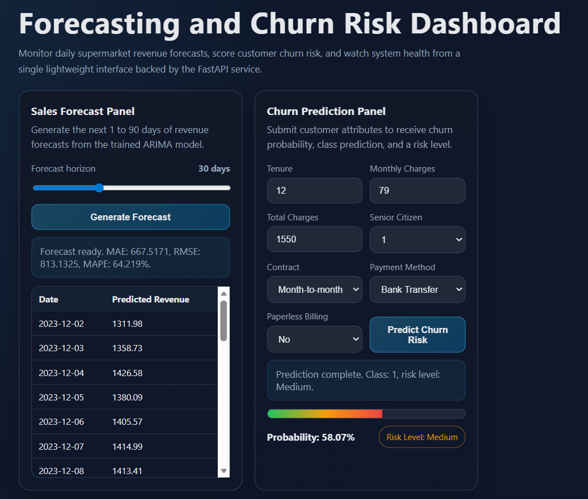
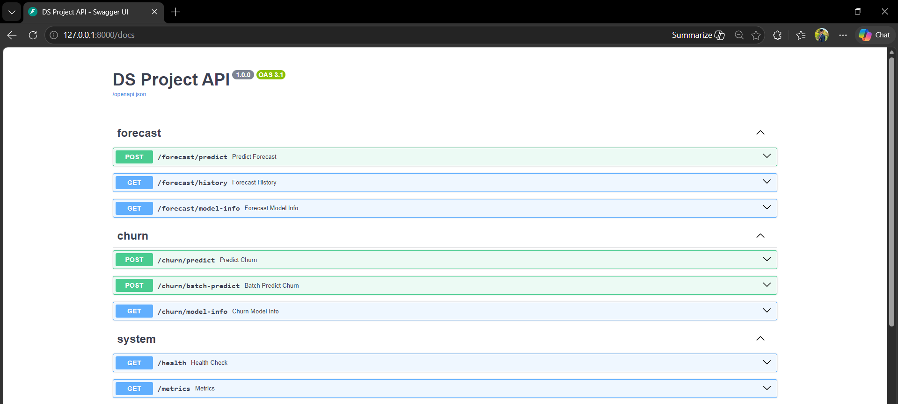
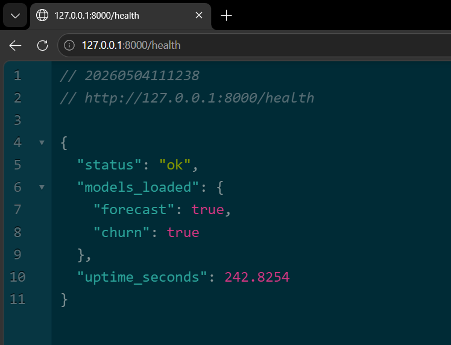
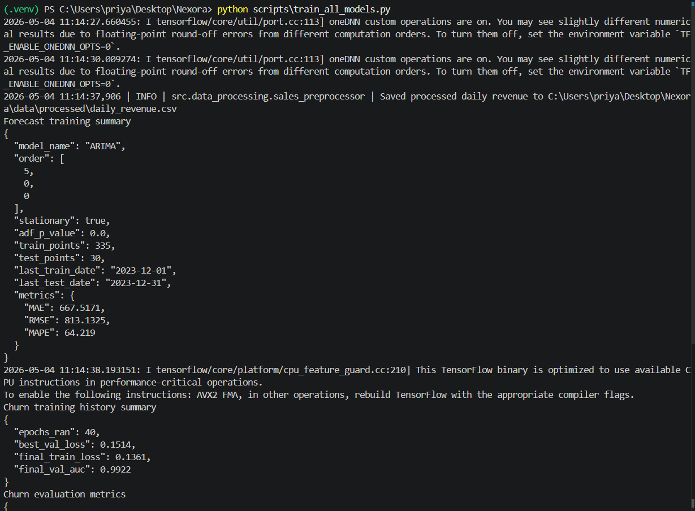
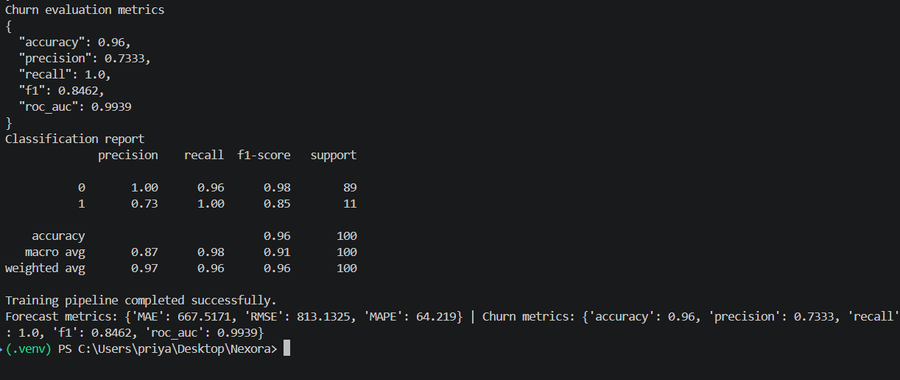

# Nexora

Production-ready MVP for daily sales forecasting and customer churn prediction, built with FastAPI, TensorFlow, ARIMA, Docker, automated tests, and a lightweight browser UI.

## Overview

Nexora combines two machine learning workflows inside one deployable application:

- Sales forecasting from `data/supermarket_sales.csv`
- Customer churn prediction from `data/customer_churn.csv`

The project is designed as an end-to-end portfolio and academic submission repository. It includes data preprocessing, model training, saved artifacts, inference services, a web interface, runtime monitoring, unit tests, Docker configuration, and an auto-generated PDF project report.

## Problem Statement

This project addresses two practical business problems:

- How can a retail team forecast short-term daily revenue to support planning, staffing, and inventory decisions?
- How can a customer retention team identify churn risk early enough to intervene before a customer leaves?

Nexora answers both questions with a hybrid machine learning stack:

- ARIMA for time-series revenue forecasting
- Dense neural network for churn classification

## Key Features

- Daily revenue aggregation and preprocessing for time-series forecasting
- Binary churn classification with class weighting and early stopping
- FastAPI backend with forecast, churn, health, and metrics endpoints
- Minimal frontend dashboard in plain HTML, CSS, and JavaScript
- Monitoring for request count, latency, error rate, and endpoint usage
- Trained artifact persistence under `data/processed/`
- Unit tests for preprocessing and inference
- Dockerfile and Docker Compose setup
- Automated PDF report generation with embedded project screenshots

## Datasets

| Dataset | Rows | Columns | Purpose |
| --- | ---: | ---: | --- |
| `supermarket_sales.csv` | 2,000 | 14 | Forecast future daily revenue |
| `customer_churn.csv` | 500 | 9 | Predict customer churn risk |

### Sales dataset

- Source file: `data/supermarket_sales.csv`
- Date coverage: `2023-01-01` to `2023-12-31`
- Raw observed daily points: `364`
- Continuous processed daily points: `365`
- Modeling target: daily aggregated `Total` revenue

### Churn dataset

- Source file: `data/customer_churn.csv`
- Positive churn rate: about `10.6%`
- Input features after preprocessing: `9`
- Modeling target: binary `Churn` label

## Solution Architecture

The project follows a layered architecture:

1. Raw CSV files are loaded from `data/`
2. Preprocessing logic transforms data in `src/data_processing/`
3. Models are trained from scripts in `src/training/`
4. Artifacts are saved to `data/processed/`
5. Inference helpers load artifacts from `src/inference/`
6. FastAPI serves endpoints from `api/`
7. Monitoring is handled by `src/monitoring/logger.py`
8. The dashboard is served from `ui/index.html`
9. The PDF report is generated from `scripts/generate_project_report.py`

## Repository Structure

```text
Nexora/
|-- api/
|   |-- main.py
|   |-- schemas.py
|   `-- routers/
|-- data/
|   |-- customer_churn.csv
|   |-- supermarket_sales.csv
|   `-- processed/
|-- monitoring/
|   `-- metrics_store.json
|-- notebooks/
|-- reports/
|   `-- Nexora_Project_Report.pdf
|-- screenshots/
|-- scripts/
|   |-- train_all_models.py
|   `-- generate_project_report.py
|-- src/
|   |-- data_processing/
|   |-- inference/
|   |-- models/
|   |-- monitoring/
|   `-- training/
|-- tests/
|-- ui/
|   `-- index.html
|-- Dockerfile
|-- docker-compose.yml
|-- README.md
`-- requirements.txt
```

## Tech Stack

- Python
- FastAPI
- Uvicorn
- Pandas
- NumPy
- scikit-learn
- TensorFlow / Keras
- statsmodels
- ReportLab
- Docker

## Model Details

### 1. Sales Forecasting Model

- Model type: ARIMA
- Saved artifact: `data/processed/arima_model.pkl`
- Metadata file: `data/processed/forecast_model_info.json`
- Preprocessing output: `data/processed/daily_revenue.csv`
- Stationarity check: Augmented Dickey-Fuller test
- Final saved order from training: `(5, 0, 0)`

Forecasting pipeline steps:

1. Parse and normalize dates from the raw CSV
2. Aggregate transaction-level revenue by day
3. Fill missing dates for a continuous calendar index
4. Split the last 30 days as holdout data
5. Fit the ARIMA model on the training window
6. Save model and evaluation metadata for inference

### 2. Churn Prediction Model

- Model type: Dense neural network
- Saved artifact directory: `data/processed/churn_nn_model/`
- Metrics file: `data/processed/churn_metrics.json`
- Supporting artifacts:
  - `data/processed/churn_scaler.pkl`
  - `data/processed/payment_encoder.pkl`
  - `data/processed/churn_feature_metadata.json`

Neural network architecture:

```text
Input(9)
-> Dense(64, relu)
-> Dropout(0.30)
-> Dense(32, relu)
-> Dropout(0.20)
-> Dense(1, sigmoid)
```

Training design choices:

- Stratified train/test split
- Standard scaling for numeric features
- Ordinal encoding for contract type
- One-hot encoding for payment method
- Binary encoding for paperless billing
- Class weighting to handle churn imbalance
- Early stopping to reduce overfitting

## Actual Results

The repository already contains saved metrics from a successful local run.

### Forecast model performance

| Metric | Value |
| --- | ---: |
| MAE | 667.5171 |
| RMSE | 813.1325 |
| MAPE | 64.2190 |

### Churn model performance

| Metric | Value |
| --- | ---: |
| Accuracy | 0.9600 |
| Precision | 0.7333 |
| Recall | 1.0000 |
| F1-score | 0.8462 |
| ROC-AUC | 0.9939 |

### Churn confusion matrix

| Actual / Predicted | No Churn | Churn |
| --- | ---: | ---: |
| No Churn | 85 | 4 |
| Churn | 0 | 11 |

## Screenshots

### Dashboard



### Swagger API docs



### Health endpoint



### Training pipeline output





## Getting Started

### 1. Clone the repository

```bash
git clone https://github.com/priya-anshu/Nexora.git
cd Nexora
```

### 2. Create and activate a virtual environment

#### Windows PowerShell

```powershell
python -m venv .venv
.\.venv\Scripts\Activate.ps1
```

#### macOS / Linux

```bash
python -m venv .venv
source .venv/bin/activate
```

### 3. Install dependencies

```bash
pip install -r requirements.txt
```

### 4. Train both models

```bash
python scripts/train_all_models.py
```

This command:

- preprocesses both datasets
- trains the ARIMA forecasting model
- trains the churn neural network
- saves all artifacts into `data/processed/`

### 5. Start the API server

```bash
uvicorn api.main:app --reload
```

Open these routes after startup:

- Dashboard: `http://127.0.0.1:8000/`
- Swagger docs: `http://127.0.0.1:8000/docs`
- Health check: `http://127.0.0.1:8000/health`
- Metrics: `http://127.0.0.1:8000/metrics`

### 6. Run tests

```bash
pytest tests/ -v
```

Or use the helper script:

```bash
bash scripts/run_tests.sh
```

## Docker Usage

Build and run with Docker Compose:

```bash
docker compose up --build
```

The Docker setup:

- installs dependencies
- copies the full project into the container
- trains both models during image build
- starts the FastAPI server on port `8000`

## API Endpoints

| Method | Path | Description |
| --- | --- | --- |
| `GET` | `/` | Serves the dashboard |
| `POST` | `/forecast/predict` | Forecasts future daily revenue |
| `GET` | `/forecast/history` | Returns recent daily revenue history |
| `GET` | `/forecast/model-info` | Returns forecast model metadata |
| `POST` | `/churn/predict` | Predicts churn for one customer |
| `POST` | `/churn/batch-predict` | Predicts churn for multiple customers |
| `GET` | `/churn/model-info` | Returns churn model metrics and architecture info |
| `GET` | `/health` | Returns service health and model load status |
| `GET` | `/metrics` | Returns monitoring metrics |

## Example Requests

### Forecast request

```bash
curl -X POST "http://127.0.0.1:8000/forecast/predict" \
  -H "Content-Type: application/json" \
  -d "{\"steps\": 7}"
```

### Churn request

```bash
curl -X POST "http://127.0.0.1:8000/churn/predict" \
  -H "Content-Type: application/json" \
  -d "{\"tenure\":21,\"monthly_charges\":113.0,\"total_charges\":1753.0,\"contract\":\"Month-to-month\",\"payment_method\":\"Electronic Check\",\"paperless_billing\":\"Yes\",\"senior_citizen\":1}"
```

### PowerShell health check

```powershell
Invoke-RestMethod http://127.0.0.1:8000/health
```

## Monitoring

The API includes a thread-safe metrics logger that tracks:

- total requests
- total errors
- average latency in milliseconds
- requests grouped by endpoint

Monitoring snapshots are appended to:

```text
monitoring/metrics_store.json
```

This gives the project a lightweight operational visibility layer without requiring an external monitoring service.

## PDF Report Generation

The repository includes a Python script that generates a detailed project report in PDF format and embeds the project screenshots automatically.

Generate the report with:

```bash
python scripts/generate_project_report.py
```

Output:

```text
reports/Nexora_Project_Report.pdf
```

You can open the generated report directly from the repository:

- [Project Report PDF](reports/Nexora_Project_Report.pdf)

## Validation Summary

The project has already been validated through:

- successful end-to-end training with `scripts/train_all_models.py`
- successful API startup with both models loaded
- unit tests for preprocessing and inference
- live endpoint checks for forecast, churn, and health routes

## Limitations

- The churn model is strong on the available dataset, but the dataset is still small.
- The ARIMA forecasting pipeline works correctly, but the holdout error is relatively high because the revenue series is volatile.
- Docker files are included, but final container validation still depends on Docker being installed on the target machine.

## Future Improvements

- Tune the forecasting pipeline with richer seasonal or exogenous features
- Compare ARIMA against Prophet or other modern forecasting approaches
- Add authentication and role-based access for production use
- Export monitoring metrics to Prometheus, Grafana, or another observability stack
- Add CI/CD workflows for automated testing and report generation

## Notes

- The sales dataset in this workspace uses ISO-style dates such as `2023-08-08`, so the sales preprocessor accepts both ISO and `MM/DD/YYYY`.
- If model artifacts are missing, the API startup flow can retrain them automatically.
- All model inference runs locally. No external paid API is required.

## Author

Repository: [priya-anshu/Nexora](https://github.com/priya-anshu/Nexora)
